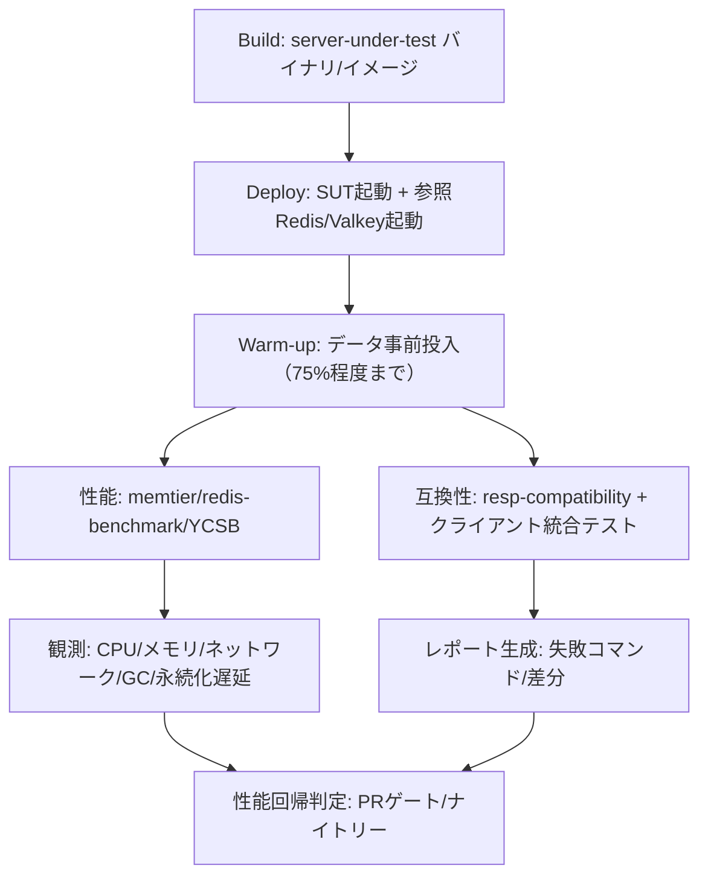

# Redis互換OSS向けベンチマーク／テストツール調査レポート

## エグゼクティブサマリ

Redis互換のOSS（Dragonfly/Garnetに続く自作プロジェクト）を「実装が進むほどに品質が上がる」形で評価するには、**互換性（正しさ）**と**性能（速さ）**を分離し、さらに性能を「スループット／レイテンシ（特にテール）／資源効率／耐障害性／スケール特性」に分解して、**公開ベンチマークと同じ負荷定義**で再現できることが重要です。Redis公式も「別ツール同士の結果比較は無意味」「クライアントがボトルネックになり得る」「パイプライン・接続数・ネットワークが結果を大きく変える」ことを明確に注意しています。citeturn9view2turn13view0

結論として、OSSプロジェクトの“標準装備”としては次の三層構成が最も実行可能です。

- **互換性（統合テスト）層**：RESP/コマンド互換の自動判定に *resp-compatibility*、加えて複数クライアントの統合テスト（実例としてUpstashが「各コード変更後に複数クライアントのコマンド統合テストを走らせる」運用を公開）。citeturn8view1turn12view0  
- **性能（負荷試験）層**：微視的性能は *memtier_benchmark* を主軸（Dragonfly公式・コミュニティ・Phoronix/PTSが同系統で採用）、補助として *redis-benchmark/valkey-benchmark*（手軽なスモーク）と *YCSB*（学術的に確立したワークロード枠組み）を併用。citeturn9view0turn7view0turn14view0turn8view3turn6search0turn6search23  
- **再現性（自動化・観測）層**：Redis/entity["company","Intel","semiconductor company"]が推進する *Redis Benchmarks Specification* と、その実行補助 *redisbench-admin* の思想（「almost 60」規模のベンチ＋プロファイル＋テレメトリ収集）を参考に、CIは基本“自己ホスト runner”へ寄せ、metrics/profiling（perf/eBPF/GCなど）を同時採取。citeturn11view1turn11view2

本レポートでは、DragonflyとGarnetが実際に使っている負荷定義・起動パラメータ・検証観点を抽出し、**クラウド／オンプレ双方で再現できる手順**、**推奨シナリオ（コマンド例・設定例）**、および**ベースライン目安（公開データ由来）**を提示します。citeturn7view0turn16view2turn14view0

## 評価目的と要件の整理

本件の「目的（何を良くするか）」は、Redis互換OSSの典型ユース（キャッシュ、キュー、セッション、簡易KVSなど）に照らすと、少なくとも次の5系統に分解すると測定設計が破綻しにくいです。

**互換性**：RESP（RESP2/RESP3）とコマンド仕様・戻り値・エラー・境界条件の一致。Redis/Valkeyはプロトコル仕様を公開しています（RESPの型・ request/response 形など）。citeturn3search15turn2search8  
**性能（スループット）**：QPS/ops/sec（総 ops とコマンド別）、スケールの仕方（接続数・スレッド数増加時の伸び）。Dragonfly/Garnetはいずれも「クライアント側がボトルネックになる」前提で、負荷生成の設計や別マシン配置を推奨しています。citeturn7view0turn1search28turn9view2  
**性能（レイテンシ）**：p50/p95/p99/p99.9（Garnetは複数パーセンタイルの比較図を提示し、Dragonflyはp99・p99.9まで出しています）。citeturn7view0turn16view2turn7view1  
**メモリ効率**：同一データセットでの `used_memory` / RSS / peak / fragmentation 相当、スナップショット時のメモリスパイク。Dragonfly公式は「~5GBのデータを入れて更新トラフィック＋BGSAVEで挙動を見る」手法を明記。citeturn7view1turn5search3turn8view0  
**耐障害性・スケーラビリティ**：ネットワーク劣化、プロセス強制停止、レプリケーション同期、（実装していれば）クラスタ／シャーディング、永続化（AOF/RDB相当）の遅延。Microsoft Learnは「フェイルオーバー条件でも測る」ことを推奨し、TLSや空キャッシュが結果を歪める点も指摘しています。citeturn13view1turn13view0

また、**比較の“公正さ”**は先に固定してください。Redis公式は、(1) 別ベンチツール同士を比較してはいけない、(2) 単一Redisプロセス vs マルチスレッド実装の単純比較は不公平になり得る、(3) パイプライン長・接続数・ネットワークが大きく効く、と明確に述べています。citeturn9view2turn11view0

## ベンチマークとツールの比較

下表は「公開・入手容易・OSSで使い回しやすい」ことを優先し、性能（負荷生成・結果収集）と互換性（統合テスト）と自動化（CIで回す）を混在させずに比較できるよう整理したものです。

> 注：表の「再現性」は“同じ手順で何度でも近い分布が得られるか（環境固定のしやすさ）”、「CI統合の容易さ」は“GitHub Actions等に載せやすいか（実行時間・環境要件・権限）”を目安で示します。GitHubホストrunner上での比較は便利ですが、ハードウェアの揺らぎを本質的に含みます（ただし「PRでの回帰検知」には有用）。citeturn12view2turn15search10  

| ベンチ／ツール名 | 入手先URL | 主な特徴 | 長所・短所 | CI統合の容易さ | 再現性 | 推奨用途 |
|---|---|---|---|---|---|---|
| memtier_benchmark | https://github.com/redis/memtier_benchmark | Redis由来の負荷生成。マルチスレッド/マルチクライアント、Read:Write比、キー分布（ランダム/シーケンシャル等）、TTL、クラスタ、TLS等。citeturn9view0turn9view2 | **長所**：高負荷でもクライアントがボトルネックになりにくい設計、Redis互換実装間で比較しやすい。**短所**：ワークロード定義を誤ると「現実を外す」（例：空キャッシュ、過大パイプライン）。citeturn13view0turn9view2 | 中（短時間スモーク可だが、安定比較は自己ホスト推奨）citeturn15search10 | 中〜高（環境固定で高、共有runnerで中）citeturn12view2 | スループット/レイテンシの主軸ベンチ、公開結果との比較（Dragonfly/PTS等）citeturn7view0turn14view0 |
| redis-benchmark | https://redis.io/docs/latest/operate/oss_and_stack/management/optimization/benchmarks/ | Redis同梱の簡易ベンチ。N clients / M requests。デフォルトはパイプラインなし（`-P`で有効）。citeturn4search2turn9view2 | **長所**：導入が最軽量、互換性スモークにも便利。**短所**：デフォルト挙動は最大性能を表さない／比較には同条件の設計が必要。citeturn9view2 | 高 | 低〜中（クライアントがボトルネックになりやすいケースあり）citeturn7view0turn9view2 | PRごとの簡易性能スモーク、機能の“動く”確認 |
| valkey-benchmark | https://valkey.io/topics/benchmark/ | Valkey同梱ベンチ。カスタムコマンド連結、`__rand_int__`/`__data__`などプレースホルダ。citeturn8view3 | **長所**：Redis互換系（Valkey基準）の手軽な比較。**短所**：深いワークロード設計はmemtier/YCSBに劣る。 | 高 | 低〜中 | Valkey互換系との手早い比較、開発者向けスモーク |
| Resp.benchmark（Garnet） | https://microsoft.github.io/garnet/docs/benchmarking/resp-bench | Garnet同梱のRESPベンチ。ロード→単一コマンド計測の2フェーズ。スレッド・バッチ・DBサイズ等を細かく制御。citeturn7view2turn16view2 | **長所**：Garnet論文/公式結果と同じ方法論で再現可能。**短所**：.NET実行環境が必要、他実装へ横展開するには調整が要る。citeturn7view2turn10search5 | 中 | 中〜高（環境固定前提） | Garnet比較、クライアントオーバーヘッドを抑えた評価 citeturn7view3turn1search28 |
| resp-compatibility（互換性テスト） | https://github.com/tair-opensource/resp-compatibility | “Redis-likeがどのRedisバージョン互換か”を判定するテスト。Python実行、対象Redisバージョン指定、失敗詳細表示。citeturn8view1 | **長所**：互換性を“命令セット×バージョン”で可視化しやすい。**短所**：網羅性はテストケース次第（拡張/自作コマンドは別途）。citeturn8view1 | 高 | 高（同一ケースなら安定） | RESP/コマンド互換のゲート（PR必須） |
| Redis Benchmarks Specification | https://github.com/redis/redis-benchmarks-specification | entity["company","Redis","database company"]とIntelの協業で作られた、性能/観測の標準化＋自動化枠組み。ほぼ60ベンチ、拡張可能。citeturn11view1turn4search1 | **長所**：ベンチ定義・テレメトリ・回帰検知を“仕様”として運用可能。**短所**：導入は重め（環境/ランナー/権限）。citeturn11view1 | 低〜中（自己ホスト前提が現実的）citeturn15search10 | 高（ラボ化できれば非常に高い） | nightly/weeklyの回帰検知、性能工学（perf/eBPF等）citeturn11view1turn11view2 |
| redisbench-admin | https://github.com/redis-performance/redisbench-admin | ベンチ基盤のセットアップ／実行／結果出力、複数ベンチツール対応（memtier/redis-benchmark/YCSB等）、プロファイラ付与も想定。citeturn11view2 | **長所**：実行・収集を“運用ツール”として整えられる。**短所**：依存が多くCIの最初の敷居は高い。 citeturn11view2 | 中 | 高（運用が固まれば） | 大規模ベンチ運用の土台、再現実験のテンプレ化 citeturn11view2 |
| YCSB（論文＋実装） | （論文）https://dl.acm.org/doi/10.1145/1807128.1807152 （実装）https://github.com/brianfrankcooper/YCSB | entity["organization","Yahoo!","internet company"]発の代表的KVSベンチ枠組み。Workload A/B等の標準化、拡張可能。citeturn6search4turn6search23turn6search0 | **長所**：学術的に確立したワークロード枠組み、現実的な読み書き混在を表現。**短所**：Redis互換の“コマンド多様性”は別途設計が必要（YCSBは基本read/update中心）。citeturn6search0turn6search23 | 中 | 中〜高（パラメータ固定で高） | “アプリ寄り”の負荷（read-heavy等）、他NoSQLとの比較軸 citeturn6search0turn6search23 |
| Phoronix Test Suite / OpenBenchmarkingプロファイル | （例）https://openbenchmarking.org/test/pts/memtier-benchmark-1.5.0 | ベンチプロファイル化でインストール〜測定〜レポートを自動化、公開結果との比較も可能。citeturn14view0turn4search3turn12view3 | **長所**：手順が“プロファイル”に固定され、再現性を持ちやすい。公開データ（分布/中央値）も参照できる。citeturn14view0turn12view3 **短所**：プロファイルが自分の目的とズレると意味が薄い。 | 中 | 中〜高 | “公開ベースライン”と比較する、環境差を可視化 citeturn14view0 |
| redis-comparison-benchmarks（コミュニティ） | https://github.com/centminmod/redis-comparison-benchmarks | GitHub Actions runnerで複数Redis互換エンジンを比較。Docker host network、CPU pin、memtier（Gaussian key分布、512B、1:15等）を明記。citeturn12view2 | **長所**：CIで動く比較例として極めて具体的（コマンド/条件が明示）。**短所**：共有runner由来の揺らぎは避けられない。citeturn12view2turn15search10 | 高（そのまま真似できる） | 低〜中 | PRでの相対比較、パラメータ設計の参考（特に分布設定）citeturn12view2 |
| Toxiproxy（耐障害性） | https://github.com/Shopify/toxiproxy | entity["company","Shopify","ecommerce company"]がOSS化したネットワーク障害注入TCPプロキシ。テスト/CI向け。citeturn2search2turn15search5 | **長所**：特定コネクションに遅延/切断/帯域制限等を決定的に注入。**短所**：コンテナ/ネットワーク構成の理解が必要。citeturn2search2 | 中 | 中〜高 | レプリケーション/クライアント再試行/タイムアウトの統合テスト citeturn2search2 |
| Chaos Mesh（耐障害性/K8s） | https://chaos-mesh.org/docs/simulate-network-chaos-on-kubernetes/ | K8s上でNetworkChaos（遅延/損失/帯域/分断等）をYAMLで注入。citeturn2search3turn2search27 | **長所**：GitOpsで障害注入シナリオを管理できる。**短所**：K8s前提、学習コスト。citeturn2search3 | 中 | 中〜高 | K8s運用を想定した耐障害性テスト、夜間ジョブに向く citeturn2search3 |
| tc netem（耐障害性/Linux） | https://man7.org/linux/man-pages/man8/tc-netem.8.html | Linux標準の帯域/遅延/損失/順序入替を注入するqdisc。citeturn5search0turn5search11 | **長所**：追加コンポーネント不要、低レイヤで強力。**短所**：root権限が要る、誤るとホスト通信を壊す。citeturn5search0 | 低（CIで権限が壁） | 高（実験条件は固定しやすい） | オンプレ/自己管理VMでの“ネットワーク劣化”再現 citeturn5search0 |
| Testcontainers Redis拡張（統合テスト基盤） | https://github.com/redis-field-engineering/testcontainers-redis | TestcontainersでRedis（単体/クラスタ等）を扱う拡張。citeturn15search0 | **長所**：統合テストを“依存コンテナ付き”で書ける。**短所**：Docker実行環境必須、CIでのDIND等の制約。citeturn15search0 | 高 | 中〜高 | “互換OSSサーバをコンテナ起動→クライアント統合テスト”の土台 |
| dotnet-counters / dotnet-trace（GC/CPU観測） | https://learn.microsoft.com/en-us/dotnet/core/diagnostics/dotnet-counters https://learn.microsoft.com/en-us/dotnet/core/diagnostics/dotnet-trace | .NETランタイムのCPU/GCヒープ等を観測・トレース収集。citeturn10search4turn10search5 | **長所**：Garnet等.NET実装の性能要因（GC/CPU）を可視化しやすい。**短所**：.NET前提。 | 中 | 中〜高 | Garnet比較・自作.NET実装の回帰検知 citeturn10search4turn10search5 |
| Go pprof / GODEBUG（GC/レイテンシ観測） | https://pkg.go.dev/net/http/pprof https://go.dev/doc/gc-guide | Go実装のCPU/heap/ブロック等のプロファイル、GCトレース（`GODEBUG=gctrace=1`）。citeturn10search2turn10search3 | **長所**：Go Redis互換実装のボトルネック特定に強い。**短所**：本番露出は注意（運用設計が必要）。citeturn10search2 | 中 | 中〜高 | 自作Go実装、Goクライアント/ベンチのCPU/GC要因分析 |

## DragonflyとGarnetのベンチ手法と結果の比較

ここでは「何をどう測ったか」を中心に、**再現可能な“手法の差”**と、読み取れる範囲の**結果の目安**を整理します（数値は条件依存が大きいので、必ず“同じ条件で再測定”を前提にしてください）。citeturn9view2turn13view0

### Dragonfly（公式ドキュメント／READMEから抽出）

**負荷生成**：Dragonfly公式は *memtier_benchmark* を主要ツールとして推奨し、`redis-benchmark` は「しばしばクライアント側がボトルネックになりやすい」旨を明記しています。また、公式リポジトリ内に `dfly_bench` も用意しています。citeturn7view0  
**配置**：クライアントとサーバは別マシン推奨、同一AZ・プライベートIP、AWSならplacement group等で遅延要因を減らすとしています。citeturn7view0  
**スレッド**：DragonflyはデフォルトでvCPUを使い、明示制御は `--proactor_threads=<N>`。citeturn7view0  

**公開されている具体例（目安）**：  
- 公式ドキュメント例では、AWS上で `memtier_benchmark --ratio 1:0`（書き込みのみ）を用い、**約4.2M QPS（Sets）**、平均約0.39ms、p99約0.687ms、p99.9約2.543msの例を示しています。citeturn7view0  
- 公式READMEでは、memtierでのベンチを前提に、**p99（set/get/setex）の目安（ms）**や、`--pipeline=30` 時に「SETで10M QPS・GETで15M QPS」到達と記載しています（いずれも環境依存の“到達例”）。citeturn7view1  

**メモリ効率の測り方（公式が明示）**：  
DragonflyとRedisを `debug populate 5000000 key 1024` で約5GB埋め、memtierで更新トラフィックを流しつつ `bgsave` し、メモリ効率（スパイク等）を比較する手法を記載しています。citeturn7view1turn5search3

### Garnet（公式ドキュメント／結果ページから抽出）

Garnetはentity["company","Microsoft","software company"] ResearchのRedis互換キャッシュストアで、公式に「既存Redisクライアントで利用可能」「スループット・レイテンシ・スケーラビリティ等」を掲げています。citeturn1search4turn3search18

**負荷生成**：Garnetは自前ツール *Resp.benchmark* を用い、結果はこれで生成するとしています。citeturn7view3turn7view2  
**環境**：Azure Standard F72s v2 VMを2台（片方サーバ、片方クライアント）に分け、Ubuntu 20.04・accelerated TCP有効という構成を明記。citeturn7view3turn1search20  
**比較対象**：Redis 7.2 / KeyDB 6.3.4 / Dragonfly 6.2.11（当時）と比較、キーはuniform random、データはメモリ内に収まる条件としています。citeturn7view3turn1search8  
**起動パラメータの提示**：Redisは `--save "" --appendonly no --io-threads 32` 等を含む起動パラメータ、Dragonfly/KeyDBも条件を明示しています（比較の再現性を高める重要ポイント）。citeturn7view3turn16view3  

**ワークロード設計（結果ページの記述）**：  
- Throughput試験はDBを事前ロード（小：1024 keys、大：256M keys）してから測定。citeturn7view3turn16view2  
- レイテンシ試験は「空DB」「GET/SET混在（80/20）」「小さなキー空間（1024 keys）」「バッチなし（batchsize=1）」など、低遅延を観察する設計を採用（percentileまで比較）。citeturn16view2  
- Throughputの例として「GETの大バッチ（4096/batch）」「8-byte keys/values」等、ネットワークオーバーヘッドを減らしてスケールを見る条件を明示しています。citeturn16view2  

### 両者から得られる“自作Redis互換OSS”向け教訓

- **クライアントとサーバを分離**する（Dragonfly/Garnetともに“2台構成”を標準にしている）。citeturn7view0turn7view3  
- **キー空間サイズを2系統**持つ（“キャッシュに収まる小DB”と“キャッシュを超える大DB”）——Garnetは1024 vs 256M keysで明示。citeturn16view2  
- **レイテンシ測定は percentiles を必須**（Garnetはp99/p99.9を図示、Dragonflyもp99/p99.9まで提示）。citeturn7view0turn16view2turn7view1  
- **比較の公正さ**：マルチスレッド実装とRedisの比較は手法が争点になりやすく、Redis側は「単一プロセスRedis vs マルチスレッド実装の比較は実運用とズレる」と反論し、代替として“複数シャードRedis Cluster”で比較したと述べています。citeturn11view0  

## 推奨テストマトリクスと再現手順

ここからは「あなたの自作Redis互換OSS」を対象に、**実行可能な推奨シナリオ（コマンド例・設定例）**を提示します。環境が未指定のため、クラウド／オンプレ両対応で、再現性を最優先にした手順にしています。citeturn7view0turn13view0turn9view2

### テスト全体のワークフロー（Mermaid）



（“事前投入”の重要性はMicrosoft Learnが明示。空キャッシュだと実運用より良い数値が出やすい点に注意。）citeturn13view0turn13view1

### シナリオ群

**シナリオA：Redis互換性ゲート（PR必須）**

1) *resp-compatibility* で「どのRedisバージョン互換か」を毎PRで測る（例：6.2/7.0/7.2等）。ツールは `--specific-version` と `--show-failed` を備え、成功率と失敗詳細を出せます。citeturn8view1  

```bash
# 例: Redis 7.2.0互換性を検査（失敗詳細付き）
python3 resp_compatibility.py \
  -h 127.0.0.1 -p 6379 \
  --testfile cts.json \
  --specific-version 7.2.0 \
  --show-failed
```

2) “実クライアント差分”を拾うため、主要クライアントの統合テストも走らせる（Upstashは「各コード変更後＆定期的に、Node-Redis/Jedis/Lettuce/Go-Redis/Redis-pyのコマンド統合テストを走らせる」と明記）。citeturn12view0  
   - 最低限の推奨：**クライアント接続・パイプライン・トランザクション・Pub/Sub・Lua・スキャン系・期限（TTL）**の差が出やすい領域を重点化。  
   - あなたのOSSが“Redis互換の範囲外”の機能を持つ場合は、互換テストとは別に“拡張仕様テスト”として切り分ける。

補助として、Python側でRedisプロトコル互換を再現する *fakeredis* は「実サーバなしでRedis/Valkey/Dragonfly/KeyDB等を前提にするテストが可能」と説明しており、“クライアント側の期待挙動”を固める用途に使えます（ただしこれはサーバ実装の正しさ証明ではなく、テストダブル用途）。citeturn12view1  

---

**シナリオB：スループット／レイテンシの基礎ベンチ（memtier中心）**

Dragonfly公式が示すように、負荷生成は **memtier_benchmark** を中心に設計し、クライアントとサーバを分離します。citeturn7view0turn9view0

**推奨ワークロード定義（テンプレ）**

- データサイズ：value 32B / 256B / 1KB / 4KB（ネットワーク影響が段階的に出る）  
- キー空間：小（1024〜1M）＋大（10M〜256M相当）  
- 分布：Uniform（R:R）と、偏りを持つ分布（Gaussian等）を両方（コミュニティ例はGaussian 3M keysを採用）。citeturn12view2turn9view0  
- コマンド比率：  
  - Read-heavy: SET:GET = 1:10 または 1:15（例：コミュニティが1:15採用）citeturn12view2  
  - Balanced: 1:1  
  - Write-only: 1:0（Dragonfly公式例）citeturn7view0  
- 同時接続：threads × clients/thread（Microsoft Learnも「接続数が性能を大きく変える」ことを明記）。citeturn13view0turn13view1  
- パイプライン：1, 10, 30（Dragonflyはpipeline=30の到達例を提示し、Azure docsも「pipelineが大きいほどスループット↑・レイテンシ↑」と明記）。citeturn7view1turn13view0turn9view2  

**コマンド例（オンプレ/クラウド共通、非TLS）**

```bash
# 例1: Read-heavy（1:10）、value=256B、Uniform random keys、p50/p99を取得
memtier_benchmark \
  -s ${SUT_IP} -p 6379 --protocol=redis \
  --ratio=1:10 \
  --data-size=256 \
  --key-pattern=R:R --key-minimum=1 --key-maximum=10000000 \
  --threads=8 --clients=50 \
  --pipeline=1 \
  --distinct-client-seed --hide-histogram \
  --test-time=60 \
  --json-out-file=memtier_readheavy_256b.json

# 例2: pipeline=10（スループットを引き上げ、テールレイテンシ変化を確認）
memtier_benchmark \
  -s ${SUT_IP} -p 6379 --protocol=redis \
  --ratio=1:10 \
  --data-size=256 \
  --key-pattern=R:R --key-minimum=1 --key-maximum=10000000 \
  --threads=8 --clients=50 \
  --pipeline=10 \
  --distinct-client-seed --hide-histogram \
  --test-time=60 \
  --json-out-file=memtier_readheavy_256b_p10.json
```

**偏り分布（Gaussian）の例**は、GitHub Actions runner上での比較ベンチが `--key-pattern=G:G` と `--key-median/--key-stddev` を明記しています（キー偏りがあるキャッシュ的アクセスの近似）。citeturn12view2  

```bash
# 例3: Gaussian key分布（コミュニティ例の骨格を踏襲）
memtier_benchmark \
  -s 127.0.0.1 --protocol=redis -p 6379 \
  --ratio=1:15 --clients=100 --requests=5000 \
  --pipeline=1 --data-size=512 \
  --key-pattern=G:G --key-minimum=1 --key-maximum=3000000 \
  --key-median=1500000 --key-stddev=500000 \
  -t 4 --distinct-client-seed --hide-histogram
```

---

**シナリオC：Garnet流 “Throughput/Latency 分離” を取り入れる（Resp.benchmark風）**

Garnetの結果ページは、Throughput評価で「小DB(1024 keys)と大DB(256M keys)を事前ロード」し、Latency評価では「空DB」「80/20 GET/SET」「percentile比較」を採用しています。citeturn16view2turn7view3  
あなたのプロジェクトでも、同じ思想で **“throughputは十分に詰める（ネットワーク・バッチの影響も管理）”** と **“latencyは混在負荷＋percentileで見る”** を分離すると、性能劣化の原因切り分けがしやすくなります。citeturn9view2turn13view0

---

**シナリオD：メモリ効率＋永続化遅延（スナップショット/AOF相当）**

1) メモリ指標は `INFO memory`（Redis）や同等情報（Dragonflyも `used_memory`/RSS/peak等の説明を提供）で定義を揃えます。citeturn5search3turn8view0  
2) 事前投入は「75%程度まで埋める」のが現実的、という具体的なルールオブサムをMicrosoft Learnが提示しています（キー数算出式まで例示）。citeturn13view0  
3) スナップショット/永続化時の遅延は “クライアント側レイテンシの跳ね” と “サーバ側の処理時間（last_save_duration等）” を両面で見ると、原因が追いやすくなります（Dragonflyは `last_save_duration_sec` などの説明を含む）。citeturn8view0  

```bash
# 手順例（概念）
# 1) データ投入（あなたのOSSでサポートされる方法を使用。Redis互換ならSETループやmemtier loadでよい）
# 2) ベンチ中にスナップショット相当を実行
# 3) INFO / OSメトリクス / memtierレイテンシ分布を同時に保存

# Redis互換で debug populate が使える場合（テスト環境限定）
redis-cli -h ${SUT_IP} -p 6379 DEBUG POPULATE 5000000 key 1024

# 例: 更新トラフィックを流しながら測定
memtier_benchmark -s ${SUT_IP} -p 6379 \
  --ratio=1:1 --data-size=1024 \
  --key-pattern=R:R --key-minimum=1 --key-maximum=5000000 \
  --threads=8 --clients=50 --pipeline=1 \
  --test-time=120 --distinct-client-seed --hide-histogram \
  --json-out-file=memtier_update_1k.json
```

Dragonfly公式は、この系の“スナップショット中のメモリ挙動”比較を明示しています（~5GB投入＋update traffic＋bgsave）。citeturn7view1  
また、Redisの `INFO` は `used_memory` とOS上の消費（RSS）のズレ、`used_memory_peak` の意味などを説明しています。citeturn5search3

---

**シナリオE：耐障害性（ネットワーク劣化／切断／K8s障害注入）**

ネットワーク劣化は「レプリケーション」「クライアント再試行」「タイムアウト」「コネクション数増大」時に挙動差が顕在化します。ここはベンチ（性能）というより“統合テスト＋SLO観察”として設計するのが安全です。citeturn13view1turn2search2turn2search3  

- **コンテナ環境なら Toxiproxy**：ShopifyはToxiproxyを「テスト/CI/開発向けにネットワーク条件をシミュレートするフレームワーク」と説明しています。citeturn2search2turn15search5  
- **K8sなら Chaos Mesh**：NetworkChaosで遅延/損失/帯域等を注入可能。citeturn2search3turn2search23  
- **オンプレ/VMなら tc netem**：qdiscで遅延やreorderなどを注入でき、manページに具体例が示されています。citeturn5search0turn5search11  

`tc netem` の例（テスト用インタフェースに適用、解除コマンドもセットで管理）：

```bash
# 例: 10ms遅延 + 0.3%損失 を付与（インタフェースは環境に合わせて）
sudo tc qdisc add dev eth0 root netem delay 10ms loss 0.3%

# 解除
sudo tc qdisc del dev eth0 root netem
```

（netemでのreorder設定例などはmanページに記載があります。citeturn5search0）

## 推奨CI統合パターンと実装例

性能ベンチは「共有CI環境だと揺らぐ」問題があります。一方で、OSSプロジェクトでは“PRのたびに完全な性能比較”はコストが高いので、**PRは軽量スモーク＋互換性ゲート**、**nightlyで重いベンチ**が現実的です。GitHubも自己ホストrunnerの適用場面と責務を解説しており、entity["company","Amazon Web Services","cloud provider"]も自己ホストrunner運用のベストプラクティスを提示しています。citeturn15search10turn15search3  

### CIレイヤ設計（推奨）

- PR（迅速）：  
  1) build + 単体テスト  
  2) サーバ起動テスト  
  3) resp-compatibility（対象バージョンを絞る）citeturn8view1  
  4) memtier短時間スモーク（30〜60秒、1〜2条件）
- Nightly（重い）：  
  1) memtierマトリクス（valueサイズ×比率×パイプライン×接続数）  
  2) YCSB（Workload A/B等）citeturn6search0turn6search23  
  3) 耐障害（toxiproxy/chaos-mesh）citeturn2search2turn2search3  
  4) プロファイル採取（perf/eBPF/GC）— Redis/Intelのベンチ仕様がまさにこの自動化を狙っています。citeturn11view1turn11view2  

### GitHub Actions（自己ホストrunner前提）サンプル

```yaml
name: ci

on:
  pull_request:
  push:
    branches: [ main ]

jobs:
  compatibility-and-smoke:
    runs-on: self-hosted
    steps:
      - uses: actions/checkout@v4

      - name: Build server-under-test
        run: |
          make build

      - name: Start SUT
        run: |
          ./bin/sut --bind 0.0.0.0 --port 6379 &
          sleep 2
          redis-cli -h 127.0.0.1 -p 6379 PING

      - name: RESP compatibility (Redis 7.2)
        run: |
          python3 -m pip install -r tools/resp-compatibility/requirements.txt
          python3 tools/resp-compatibility/resp_compatibility.py \
            -h 127.0.0.1 -p 6379 \
            --testfile tools/resp-compatibility/cts.json \
            --specific-version 7.2.0 --show-failed

      - name: memtier smoke
        run: |
          memtier_benchmark \
            -s 127.0.0.1 -p 6379 --protocol=redis \
            --ratio=1:10 --data-size=256 \
            --key-pattern=R:R --key-minimum=1 --key-maximum=1000000 \
            --threads=4 --clients=50 --pipeline=1 \
            --test-time=30 --distinct-client-seed --hide-histogram \
            --json-out-file=smoke.json
```

自己ホストrunnerの運用やセキュリティ（短命runner、権限分離等）はAWSのベストプラクティスが参考になります。citeturn15search3turn15search10  

### 統合テスト基盤としてのTestcontainers（例）

Testcontainersは依存サービス（Redis等）をテストで起動する枠組みで、Redis拡張も存在します。これを「あなたのSUTコンテナ」に置き換えると、クライアント統合テストを“言語ごと”に回しやすくなります。citeturn15search0turn15search24  
またToxiproxyもTestcontainersモジュールが整備されており、“テストコードからネットワーク劣化を注入”できます。citeturn15search1turn15search5  

## ベースライン値の目安と比較の置き方

目標SLAが未指定の場合、「Redis互換KVSとして妥当そうな“期待像”」を置いてから測るのが実務的です。Redis/Intelのベンチ仕様紹介では、Redisの人気要因として「サブミリ秒応答」が挙げられています。citeturn11view1  
一方、Redisのレイテンシ診断ドキュメントは「通常は処理時間が極めて低い（sub-microsecond）一方で、条件により高レイテンシになる」と説明しており、**テール悪化要因（バックグラウンド処理、ネットワーク、GC、永続化など）を分離して測る**必要があります。citeturn5search2turn13view0  

### 公開データに基づく“到達目安”例

- **Redis 7.0.12 + memtier（clients=100, ratio=1:5）**：OpenBenchmarkingの公開結果では、中央値が約2.34M ops/secで、ハードウェアにより約0.2M〜4.34Mまで分布（ばらつき）を示しています。citeturn14view0  
- **Dragonfly（公式例・AWS）**：write-only（ratio 1:0）で約4.2M QPS、p99が約0.687ms、p99.9が約2.543msという例が提示されています。citeturn7view0  

これらは **「あなたの環境でのSLO」ではなく「公開情報と同じ土俵に立つための参照点」**として使い、必ず同一ネットワーク・同一負荷定義・同一クライアント条件で再測定してください。Redis公式も「別ベンチ同士の比較は無意味」「パイプライン長は実アプリ相当にすべき」と注意しています。citeturn9view2turn13view0

---

### 最低限“比較表”で固定すべきメタデータ（あなたのレポートに必須）

Dragonfly/Garnetがいずれも「起動パラメータ」「2台構成」「キー分布」「DBサイズ」を明記しているように、あなたの自作プロジェクトのベンチレポートにも次を固定で出すのが推奨です。citeturn7view0turn7view3turn16view2  

- SUT：バージョン（commit hash）、起動引数、スレッド設定（例：`--proactor_threads`相当）citeturn7view0  
- 参照系：Redis/Valkey（バージョン、起動引数、io-threads等）citeturn7view3turn9view2turn8view3  
- HW：CPU型番・コア数、RAM、NIC、カーネル、NUMA/周波数制御の有無  
- 配置：client/server分離、同一AZ/リージョン（クラウドなら）citeturn7view0turn7view3turn13view0  
- ワークロード：  
  - valueサイズ、keyサイズ、キー空間、分布（Uniform/Gaussian等）citeturn12view2turn9view0  
  - コマンド比率、パイプライン長、接続数、runtime/test-time、warm-up方法citeturn13view0turn9view2turn16view2  
- 指標：p50/p95/p99/p99.9、ops/sec、CPU/RSS、GC（該当言語）、永続化遅延（last_save等）citeturn7view0turn8view0turn10search4turn10search3  

以上を満たすと、Dragonfly/Garnetの公開手法とも比較可能で、かつあなたのOSSが成長しても回帰検知が崩れません。citeturn11view1turn11view2